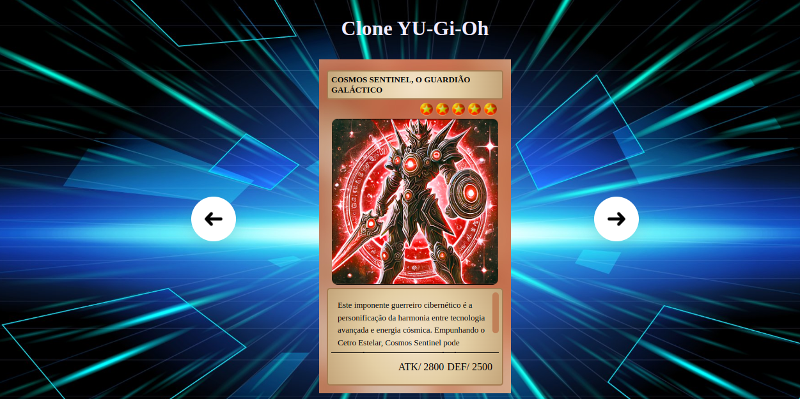

# Projeto do curso Dev em dobro

###  :open_book:  Sobre o projeto

 Nesse curso foi criado um slide de cartas. 
 
 Site - https://cartasyugioh.netlify.app/

### Layout - web  :desktop_computer:

 

### 🚀 Tecnologias utilizadas

### Front end
- HTML 
- CSS
- JS

#### Ferramentas
- [**VS CODE**]()

### Autor

 

